# 🚀 DevOps & Platform Engineering Roadmap

A comprehensive learning path from **DevOps Fundamentals** to **Platform Engineering Mastery** with **50+ hands-on projects**.

---

## 📊 Roadmap Overview


| Level | Focus Area | Duration | Key Technologies |
|-------|-----------|----------|-----------------|
| 1-3 | DevOps Fundamentals | 4-6 weeks | Linux, Git, Docker, CI Basics |
| 4-6 | Infrastructure & Orchestration | 6-8 weeks | Kubernetes, Terraform, Ansible |
| 7-9 | Advanced Operations | 8-10 weeks | GitOps, Service Mesh, Observability |
| 10 | Platform Engineering | 8-12 weeks | Backstage, Operators, Golden Paths |

---

## 🟢 Level 1-3: Beginner (DevOps Fundamentals)

### Prerequisites
- Basic programming knowledge (any language)
- Familiarity with command line

### Level 1: Foundations (Week 1-2)

#### Project 1.1: Linux Administration Essentials
**Location:** `projects/01-beginner/linux-essentials/`

| Objective | Learn core Linux commands and administration |
|-----------|---------------------------------------------|
| Skills | File systems, permissions, processes, networking |
| Deliverable | Automated system setup script |

```bash
# Key concepts covered
- File operations (ls, cd, cp, mv, rm, find)
- User management (useradd, chmod, chown)
- Process management (ps, top, htop, kill)
- Networking (netstat, ss, curl, wget)
- Package management (apt, yum, dnf)
```

#### Project 1.2: Shell Scripting for DevOps
**Location:** `projects/01-beginner/shell-scripting/`

| Objective | Automate common DevOps tasks with Bash |
|-----------|---------------------------------------|
| Skills | Variables, loops, functions, error handling |
| Deliverable | System health check automation script |

#### Project 1.3: Git & Version Control Mastery
**Location:** `projects/01-beginner/git-workflows/`

| Objective | Master Git for team collaboration |
|-----------|----------------------------------|
| Skills | Branching, merging, rebasing, conflict resolution |
| Deliverable | GitFlow workflow implementation |

---

### Level 2: Containerization (Week 3-4)

#### Project 2.1: Docker Fundamentals
**Location:** `projects/01-beginner/docker-basics/`

| Objective | Understand container concepts and Docker CLI |
|-----------|---------------------------------------------|
| Skills | Images, containers, volumes, networks |
| Deliverable | Multi-stage Dockerfile for a web app |

```dockerfile
# Example: Multi-stage build
FROM node:18-alpine AS builder
WORKDIR /app
COPY package*.json ./
RUN npm ci
COPY . .
RUN npm run build

FROM nginx:alpine
COPY --from=builder /app/dist /usr/share/nginx/html
EXPOSE 80
```

#### Project 2.2: Docker Compose Multi-Service Apps
**Location:** `projects/01-beginner/docker-compose/`

| Objective | Deploy multi-container applications |
|-----------|-----------------------------------|
| Skills | Service orchestration, networking, volumes |
| Deliverable | Web + API + Database stack |

#### Project 2.3: Container Registry & Image Management
**Location:** `projects/01-beginner/container-registry/`

| Objective | Manage images with Docker Hub/GHCR |
|-----------|-----------------------------------|
| Skills | Tagging, pushing, pulling, scanning |
| Deliverable | Automated image build pipeline |

---

### Level 3: CI/CD Introduction (Week 5-6)

#### Project 3.1: GitHub Actions Basics
**Location:** `projects/01-beginner/github-actions-intro/`

| Objective | Create your first CI pipeline |
|-----------|------------------------------|
| Skills | Workflows, jobs, steps, triggers |
| Deliverable | Build and test pipeline |

```yaml
# .github/workflows/ci.yaml
name: CI Pipeline
on: [push, pull_request]

jobs:
  build:
    runs-on: ubuntu-latest
    steps:
      - uses: actions/checkout@v4
      - name: Build
        run: npm ci && npm run build
      - name: Test
        run: npm test
```

#### Project 3.2: CI/CD with Testing & Linting
**Location:** `projects/01-beginner/ci-testing/`

| Objective | Implement quality gates in CI |
|-----------|------------------------------|
| Skills | Unit tests, linting, code coverage |
| Deliverable | Complete CI pipeline with quality checks |

#### Project 3.3: Automated Docker Builds
**Location:** `projects/01-beginner/docker-ci/`

| Objective | Build and push Docker images in CI |
|-----------|-----------------------------------|
| Skills | Docker in CI, caching, multi-arch builds |
| Deliverable | Automated container image pipeline |

---

## 🔵 Level 4-6: Intermediate (Infrastructure & Orchestration)

### Prerequisites
- Completed beginner projects
- Understanding of networking fundamentals

### Level 4: Kubernetes Fundamentals (Week 7-9)

#### Project 4.1: Kubernetes Core Concepts
**Location:** `projects/02-intermediate/k8s-basics/`

| Objective | Deploy apps to Kubernetes |
|-----------|--------------------------|
| Skills | Pods, Deployments, Services, ConfigMaps, Secrets |
| Deliverable | Stateless app deployment |

```yaml
# deployment.yaml
apiVersion: apps/v1
kind: Deployment
metadata:
  name: web-app
spec:
  replicas: 3
  selector:
    matchLabels:
      app: web
  template:
    metadata:
      labels:
        app: web
    spec:
      containers:
      - name: app
        image: nginx:alpine
        ports:
        - containerPort: 80
        resources:
          requests:
            memory: "64Mi"
            cpu: "250m"
          limits:
            memory: "128Mi"
            cpu: "500m"
```

#### Project 4.2: Kubernetes Networking & Ingress
**Location:** `projects/02-intermediate/k8s-networking/`

| Objective | Configure networking and expose services |
|-----------|----------------------------------------|
| Skills | Services, Ingress, Network Policies |
| Deliverable | Multi-tier app with ingress routing |

#### Project 4.3: Kubernetes Storage & StatefulSets
**Location:** `projects/02-intermediate/k8s-storage/`

| Objective | Deploy stateful applications |
|-----------|----------------------------|
| Skills | PV, PVC, StatefulSets, StorageClasses |
| Deliverable | Stateful database deployment |

#### Project 4.4: Helm Charts
**Location:** `projects/02-intermediate/helm-charts/`

| Objective | Package and deploy K8s apps with Helm |
|-----------|--------------------------------------|
| Skills | Charts, templates, values, releases |
| Deliverable | Custom Helm chart for your application |

---

### Level 5: Infrastructure as Code (Week 10-12)

#### Project 5.1: Terraform Fundamentals
**Location:** `projects/02-intermediate/terraform-basics/`

| Objective | Provision infrastructure with Terraform |
|-----------|----------------------------------------|
| Skills | Resources, providers, state, variables |
| Deliverable | AWS/GCP VPC with networking |

```hcl
# main.tf
terraform {
  required_providers {
    aws = {
      source  = "hashicorp/aws"
      version = "~> 5.0"
    }
  }
}

resource "aws_vpc" "main" {
  cidr_block           = var.vpc_cidr
  enable_dns_hostnames = true
  
  tags = {
    Name        = "${var.project}-vpc"
    Environment = var.environment
  }
}

resource "aws_subnet" "public" {
  count             = length(var.public_subnets)
  vpc_id            = aws_vpc.main.id
  cidr_block        = var.public_subnets[count.index]
  availability_zone = var.azs[count.index]
  
  tags = {
    Name = "${var.project}-public-${count.index + 1}"
  }
}
```

#### Project 5.2: Terraform Modules & Backend State
**Location:** `projects/02-intermediate/terraform-modules/`

| Objective | Create reusable infrastructure modules |
|-----------|---------------------------------------|
| Skills | Modules, remote state, workspaces |
| Deliverable | Modular infrastructure library |

#### Project 5.3: Ansible Configuration Management
**Location:** `projects/02-intermediate/ansible-basics/`

| Objective | Automate server configuration |
|-----------|------------------------------|
| Skills | Playbooks, roles, inventories, variables |
| Deliverable | Server hardening playbook |

```yaml
# playbook.yml
- name: Configure web servers
  hosts: webservers
  become: yes
  
  roles:
    - common
    - security-hardening
    - nginx
    
  tasks:
    - name: Ensure packages are updated
      apt:
        update_cache: yes
        upgrade: dist
```

---

### Level 6: Monitoring & Observability Basics (Week 13-14)

#### Project 6.1: Prometheus & Grafana Stack
**Location:** `projects/02-intermediate/prometheus-grafana/`

| Objective | Implement metrics monitoring |
|-----------|----------------------------|
| Skills | Metrics, alerting, dashboards |
| Deliverable | Complete monitoring stack |

#### Project 6.2: Log Aggregation with Loki
**Location:** `projects/02-intermediate/loki-logging/`

| Objective | Centralize log management |
|-----------|--------------------------|
| Skills | Log collection, queries, retention |
| Deliverable | Log aggregation pipeline |

#### Project 6.3: Application Instrumentation
**Location:** `projects/02-intermediate/app-instrumentation/`

| Objective | Add observability to applications |
|-----------|----------------------------------|
| Skills | Custom metrics, traces, structured logging |
| Deliverable | Instrumented sample application |

---

## 🟣 Level 7-9: Advanced (Cloud-Native Operations)

### Prerequisites
- Solid Kubernetes experience
- Understanding of cloud providers

### Level 7: GitOps & Continuous Delivery (Week 15-17)

#### Project 7.1: GitOps with ArgoCD
**Location:** `projects/03-advanced/gitops-argocd/`

| Objective | Implement GitOps workflow |
|-----------|--------------------------|
| Skills | App of Apps, sync waves, hooks |
| Deliverable | Full GitOps deployment pipeline |

```yaml
# argocd/application.yaml
apiVersion: argoproj.io/v1alpha1
kind: Application
metadata:
  name: production-apps
  namespace: argocd
spec:
  project: default
  source:
    repoURL: https://github.com/org/k8s-manifests
    targetRevision: main
    path: environments/production
  destination:
    server: https://kubernetes.default.svc
    namespace: production
  syncPolicy:
    automated:
      prune: true
      selfHeal: true
    syncOptions:
      - CreateNamespace=true
```

#### Project 7.2: FluxCD Alternative
**Location:** `projects/03-advanced/gitops-flux/`

| Objective | Compare GitOps tools |
|-----------|---------------------|
| Skills | Flux controllers, Kustomize integration |
| Deliverable | Flux-based deployment |

#### Project 7.3: Progressive Delivery
**Location:** `projects/03-advanced/progressive-delivery/`

| Objective | Implement canary and blue-green deployments |
|-----------|-------------------------------------------|
| Skills | Argo Rollouts, feature flags |
| Deliverable | Canary deployment workflow |

---

### Level 8: Service Mesh & Security (Week 18-20)

#### Project 8.1: Istio Service Mesh
**Location:** `projects/03-advanced/istio-mesh/`

| Objective | Implement service mesh |
|-----------|----------------------|
| Skills | Traffic management, mTLS, observability |
| Deliverable | Secured microservices communication |

```yaml
# istio/virtual-service.yaml
apiVersion: networking.istio.io/v1beta1
kind: VirtualService
metadata:
  name: reviews
spec:
  hosts:
    - reviews
  http:
    - match:
        - headers:
            end-user:
              exact: jason
      route:
        - destination:
            host: reviews
            subset: v2
    - route:
        - destination:
            host: reviews
            subset: v1
```

#### Project 8.2: Policy as Code with OPA
**Location:** `projects/03-advanced/opa-gatekeeper/`

| Objective | Enforce Kubernetes policies |
|-----------|---------------------------|
| Skills | Rego policies, Gatekeeper constraints |
| Deliverable | Security policy framework |

#### Project 8.3: Secrets Management with Vault
**Location:** `projects/03-advanced/vault-secrets/`

| Objective | Secure secrets management |
|-----------|--------------------------|
| Skills | Dynamic secrets, PKI, K8s integration |
| Deliverable | Vault-integrated cluster |

---

### Level 9: Advanced Infrastructure (Week 21-24)

#### Project 9.1: Multi-Cluster Kubernetes
**Location:** `projects/03-advanced/multi-cluster/`

| Objective | Manage multiple Kubernetes clusters |
|-----------|-----------------------------------|
| Skills | Cluster federation, multi-tenancy |
| Deliverable | Federated application deployment |

#### Project 9.2: Kubernetes-Native IaC with Crossplane
**Location:** `projects/03-advanced/crossplane/`

| Objective | Provision cloud resources from K8s |
|-----------|----------------------------------|
| Skills | Compositions, XRDs, providers |
| Deliverable | Self-service infrastructure |

```yaml
# crossplane/composition.yaml
apiVersion: apiextensions.crossplane.io/v1
kind: Composition
metadata:
  name: xpostgresql.database.example.org
spec:
  compositeTypeRef:
    apiVersion: database.example.org/v1alpha1
    kind: XPostgreSQL
  resources:
    - name: rdsinstance
      base:
        apiVersion: rds.aws.upbound.io/v1beta1
        kind: Instance
        spec:
          forProvider:
            instanceClass: db.t3.micro
            engine: postgres
            engineVersion: "15"
```

#### Project 9.3: Advanced Observability Stack
**Location:** `projects/03-advanced/observability-stack/`

| Objective | Full observability with traces |
|-----------|------------------------------|
| Skills | OpenTelemetry, Jaeger/Tempo, correlation |
| Deliverable | Complete observability platform |

#### Project 9.4: Disaster Recovery & Backup
**Location:** `projects/03-advanced/disaster-recovery/`

| Objective | Implement DR strategies |
|-----------|------------------------|
| Skills | Velero, cross-region replication |
| Deliverable | DR runbook and automation |

---

## 🟡 Level 10: Platform Engineering (Expert)

### Prerequisites
- Deep Kubernetes expertise
- Understanding of developer experience

### Platform Engineering Core (Week 25-36)

#### Project 10.1: Internal Developer Portal with Backstage
**Location:** `projects/04-platform-engineering/backstage-idp/`

| Objective | Build a developer portal |
|-----------|------------------------|
| Skills | Backstage plugins, catalog, templates |
| Deliverable | Production-ready IDP |

```typescript
// backstage/app-config.yaml
app:
  title: Platform Portal
  baseUrl: http://localhost:3000

organization:
  name: Your Company

catalog:
  locations:
    - type: file
      target: ../../catalog-info.yaml
    - type: url
      target: https://github.com/org/service-catalog/blob/main/all-services.yaml

scaffolder:
  defaultAuthor:
    name: Platform Team
    email: platform@company.com
```

#### Project 10.2: Golden Path Templates
**Location:** `projects/04-platform-engineering/golden-paths/`

| Objective | Create developer self-service templates |
|-----------|---------------------------------------|
| Skills | Scaffolding, cookiecutter, templates |
| Deliverable | Service creation templates |

#### Project 10.3: Kubernetes Operator Development
**Location:** `projects/04-platform-engineering/k8s-operator/`

| Objective | Build a custom Kubernetes operator |
|-----------|----------------------------------|
| Skills | Kubebuilder, CRDs, controllers |
| Deliverable | Custom resource operator |

```go
// controllers/application_controller.go
func (r *ApplicationReconciler) Reconcile(ctx context.Context, req ctrl.Request) (ctrl.Result, error) {
    log := log.FromContext(ctx)
    
    var app platformv1.Application
    if err := r.Get(ctx, req.NamespacedName, &app); err != nil {
        return ctrl.Result{}, client.IgnoreNotFound(err)
    }
    
    // Reconciliation logic
    deployment := r.constructDeployment(&app)
    if err := r.Create(ctx, deployment); err != nil {
        log.Error(err, "unable to create Deployment")
        return ctrl.Result{}, err
    }
    
    return ctrl.Result{RequeueAfter: time.Minute}, nil
}
```

#### Project 10.4: Platform API Layer
**Location:** `projects/04-platform-engineering/platform-api/`

| Objective | Abstract platform complexity |
|-----------|---------------------------|
| Skills | REST/gRPC APIs, orchestration |
| Deliverable | Self-service platform API |

#### Project 10.5: Chaos Engineering
**Location:** `projects/04-platform-engineering/chaos-engineering/`

| Objective | Test system resilience |
|-----------|----------------------|
| Skills | Litmus, Chaos Monkey, game days |
| Deliverable | Chaos testing framework |

#### Project 10.6: Production-Grade Kubernetes Cluster
**Location:** `projects/04-platform-engineering/production-cluster/`

| Objective | Build production-ready infrastructure |
|-----------|-------------------------------------|
| Skills | All previous skills combined |
| Deliverable | Enterprise-grade platform |

Components:
- Multi-AZ Kubernetes cluster (EKS/GKE/AKS)
- GitOps with ArgoCD
- Istio service mesh
- Complete observability (metrics, logs, traces)
- Policy enforcement (OPA)
- Secrets management (Vault)
- Internal developer portal
- Automated DR and backup

---

## 📈 Skill Progression Matrix

| Skill Area | Beginner | Intermediate | Advanced | Expert |
|------------|----------|--------------|----------|--------|
| **Containers** | Docker basics | Multi-stage, Compose | Buildah, Podman | Kata, gVisor |
| **Orchestration** | - | K8s core concepts | Multi-cluster | Operators, CRDs |
| **IaC** | - | Terraform basics | Modules, Crossplane | Platform abstractions |
| **CI/CD** | GitHub Actions | Full pipelines | GitOps (Argo/Flux) | Progressive delivery |
| **Observability** | - | Prometheus, Grafana | Full stack, tracing | SLOs, error budgets |
| **Security** | - | Basic RBAC | Vault, OPA | Zero-trust, supply chain |
| **Platform** | - | - | - | IDP, golden paths |

---

## 🗂️ Project Directory Structure

```
devops-projects/
├── ROADMAP.md                    # This file
├── README.md                     # Project overview
├── docs/                         # Documentation
├── projects/
│   ├── 01-beginner/
│   │   ├── linux-essentials/
│   │   ├── shell-scripting/
│   │   ├── git-workflows/
│   │   ├── docker-basics/
│   │   ├── docker-compose/
│   │   ├── container-registry/
│   │   ├── github-actions-intro/
│   │   ├── ci-testing/
│   │   └── docker-ci/
│   ├── 02-intermediate/
│   │   ├── k8s-basics/
│   │   ├── k8s-networking/
│   │   ├── k8s-storage/
│   │   ├── helm-charts/
│   │   ├── terraform-basics/
│   │   ├── terraform-modules/
│   │   ├── ansible-basics/
│   │   ├── prometheus-grafana/
│   │   ├── loki-logging/
│   │   └── app-instrumentation/
│   ├── 03-advanced/
│   │   ├── gitops-argocd/
│   │   ├── gitops-flux/
│   │   ├── progressive-delivery/
│   │   ├── istio-mesh/
│   │   ├── opa-gatekeeper/
│   │   ├── vault-secrets/
│   │   ├── multi-cluster/
│   │   ├── crossplane/
│   │   ├── observability-stack/
│   │   └── disaster-recovery/
│   └── 04-platform-engineering/
│       ├── backstage-idp/
│       ├── golden-paths/
│       ├── k8s-operator/
│       ├── platform-api/
│       ├── chaos-engineering/
│       └── production-cluster/
├── terraform/                    # Existing capstone terraform
├── ansible/                      # Existing ansible
├── docker/                       # Existing docker
├── k8s/                          # Existing k8s manifests
└── argo/                         # Existing argocd
```

---

## 🎯 Recommended Learning Path

```mermaid
flowchart TD
    Start([Start Here]) --> L1[Level 1: Linux & Git]
    L1 --> L2[Level 2: Docker]
    L2 --> L3[Level 3: CI/CD Basics]
    L3 --> L4[Level 4: Kubernetes]
    L4 --> L5[Level 5: Terraform & Ansible]
    L5 --> L6[Level 6: Monitoring]
    L6 --> L7[Level 7: GitOps]
    L7 --> L8[Level 8: Service Mesh & Security]
    L8 --> L9[Level 9: Advanced Infra]
    L9 --> L10[Level 10: Platform Engineering]
    L10 --> Expert([Platform Engineer! 🎉])
    
    style Start fill:#90EE90
    style Expert fill:#FFD700
```



---

## 📚 Additional Resources

### Books
- "The Phoenix Project" - Gene Kim
- "The DevOps Handbook" - Gene Kim et al.
- "Site Reliability Engineering" - Google
- "Team Topologies" - Matthew Skelton

### Certifications Path
1. **CKA** - Certified Kubernetes Administrator
2. **CKS** - Certified Kubernetes Security Specialist
3. **AWS/GCP/Azure** Cloud certifications
4. **HashiCorp** Terraform Associate

### Communities
- [CNCF Slack](https://slack.cncf.io/)
- [Platform Engineering Slack](https://platformengineering.org/)
- [DevOps Subreddit](https://reddit.com/r/devops)

---

## 🚦 Getting Started

1. **Clone this repository**
   ```bash
   git clone https://github.com/yourusername/devops-projects.git
   cd devops-projects
   ```

2. **Start with Level 1**
   ```bash
   cd projects/01-beginner/linux-essentials
   cat README.md
   ```

3. **Track your progress** - Mark completed projects in your fork

4. **Build your portfolio** - Each project is a portfolio piece

---

> **💡 Tip:** Don't rush through the levels. Build muscle memory with each concept before moving on. Real-world platform engineering requires deep understanding, not just surface-level exposure.

---

*Last Updated: January 2026*
